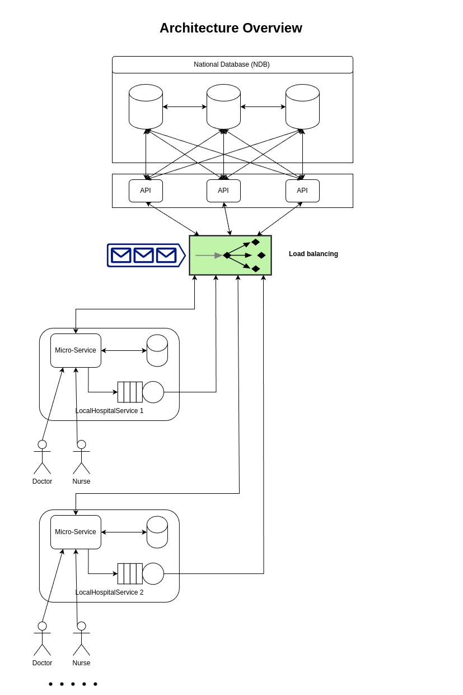
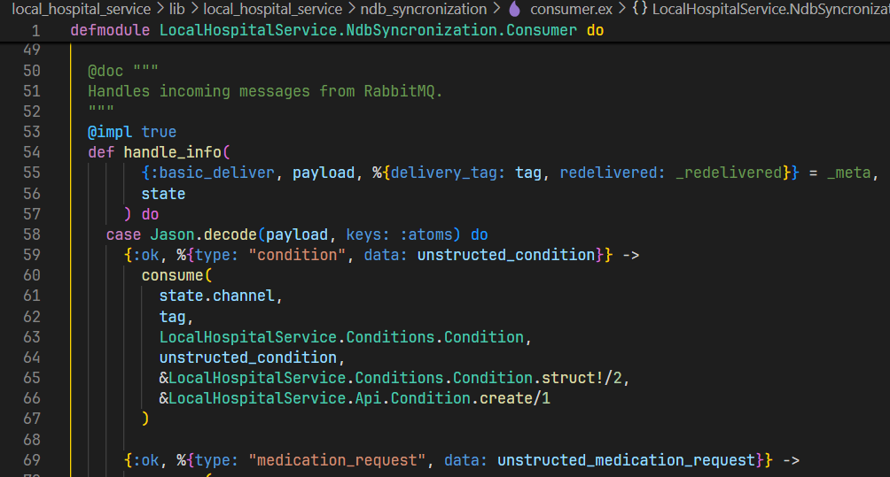
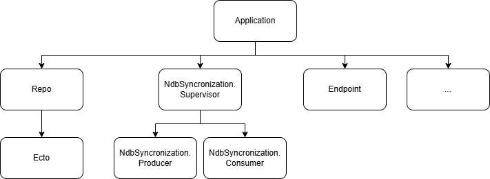
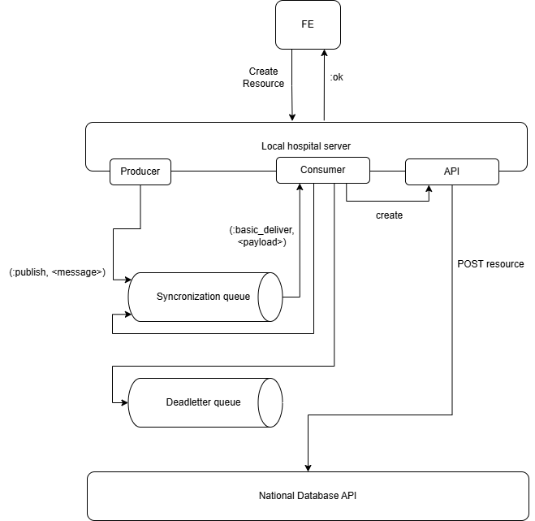
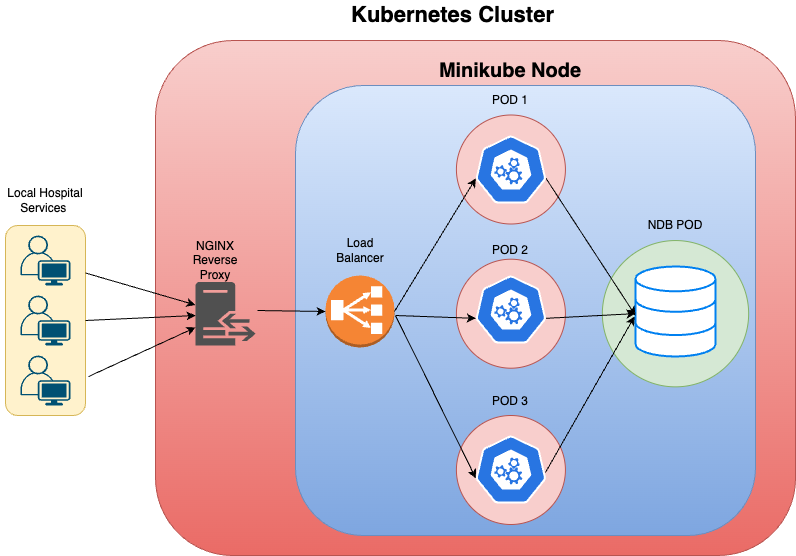
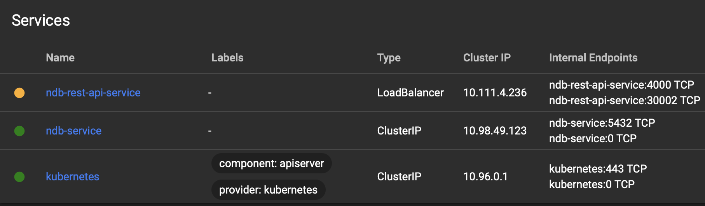
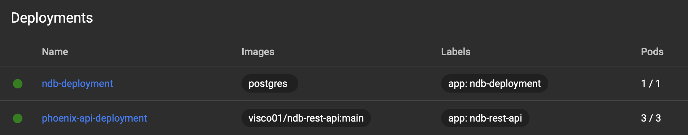
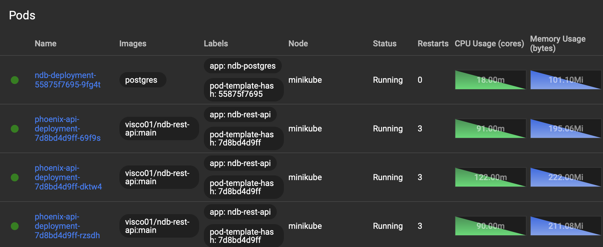

# Phoenix Final report

# Project Setup

1. Clone the repository with submodules:
    
    ```bash
    git clone --recurse-submodules https://github.com/Phoenix-HealthWeb/Phoenix-Healthweb
    ```
    
2. [Run the National Database API](https://www.notion.so/Phoenix-Final-report-1748046fbba78056a776c48d01651f5c?pvs=21)
3. [Run the Local Hospital instance](https://www.notion.so/Phoenix-Final-report-1748046fbba78056a776c48d01651f5c?pvs=21)

# Introduction (overall architecture microservices)

In the following documentation we will describe the architecture of our application, that aims to implement a service for a national-level healthcare system.
The chosen architecture style is the microservices, that allows the decoupling of each structural base component from the others, ensuring modularity, and also scalability.

# Architecture Overview



Each hospital needs to implement a Local Hospital Service. This solution is easy to deploy for a technician because it just need to use docker to get it up and running.

The National Database is a Postgres database that can be replicated to scale up if needed. It should be deployed at least one per region and it will support all the hospital of that area. The routing can be achieved through a proxy or through DNS configuration so that each hospital reaches the closest National database available.

The API layer can be scaled horizontally independently from the database.

The communication between hospitals and the APIs is done through HTTPS. An hospital needs an API key to be able to perform requests. This is done for protecting the APIs from unauthorized users. The local hospitals can not be accessed from Internet, they are accessed only by practitioners in the hospital and the service makes the requests for them. Each practitioner needs to be authenticated in the local hospital service where is working.

# Local Hospital Service

The Local Hospital Service has been developed using the [Elixir programming language](https://elixir-lang.org/) and the related [Phoenix web framework](https://www.phoenixframework.org/). It is the main hospital instance that allows the healthcare service to be provided as a standalone hospital.
The application allows the control of patients arrivals by the first entity involved, the nurses. Nurses have their own dashboard where they can verify the fiscal code of an incoming patient and check if it is already registered in the National Database, if not, they provide to insert it in a local synchronization queue that will be synchronized with the NDB. Nurses are also able to populate a new **resource**, the encounters, always accessible from the dashboard, and then they are able to assign priority codes to patients, reason of the visit, ward and so on.

All these elements in the Phoenix HealthWeb app can be generated with the help of a “**mix task**”. The Phoenix framework is based on the Elixir language and from the CLI it is possible to run mix tasks that automatize part of the app developement. A few examples are **mix phx.gen.auth** for generating authentication modules, **mix phx.gen.context** for the creation of a specific functionality of the app (business logic) and the very interesting **mix phx.gen.live**. mix phx.gen.live allows the generation of an interactive user interface offering a **LiveView** module complete with schema, controller and html templates.

LiveViews allow for a dynamic rendering of the application frontend via events sent on a socket connection, rather then traditional page generation via browser navigation. This ensures a smoother user experience, while also allowing to keep the internal state of the frontend during navigation.
This has been used, for example, for the **patients LiveView**, by launching `mix phx.gen.live Hospital Patient patients cf:string firstname:string lastname:string date_of_birth:date gender:string`.

After this, a crucial step are **migrations** as they perform schema changes to the database’s tables keeping it up to date. Local database’s structure is accessed through the use of the **Ecto library**. It’s an ORM module that enables the creation of schemas, queries handling, migrations and changesets for data validation.

## Event-driven architecture

As seen before, LiveViews are inherently event-based, since their fundational behaviour consists on the exchange of messages (describing events) back and forth between the server and the client.

In addition to LiveViews, this architecture plays a central role in ensuring the availability of the LocalHospitalService in case the connection with the National Database API is lost. Each hospital comes in fact with a local RabbitMQ instance, that basically contains two queues:

- `ndb_synchronization_queue` Is the main queue, responsible for the data synchronization from the local hospital to the National Database. An hospital produces different types of data that must be preserved to ensure the full medication history of any patient. In or application, we have the following medical resources:
    - `Patient` Represents a patient with its anagraphical data
    - `Condition` A long term management of a symptom, problem or diagnosis related to a Patient
    - `Observation` Any kind of measurement performed on a Patient, for example vital signs, imaging results, physical and mental characteristics
    - `Medication Request` A prescription of a medication for a Patient, along with instructions on the posology and administration of it
    
    **Note:** These resource types are taken from the [Fast Healthcare Interoperability Resources](https://it.wikipedia.org/wiki/Fast_Healthcare_Interoperability_Resources) standard. Altough we have implemented just a small subset of it, we tought that following an actual standard would give us a closer result to a real-world application.
    
- `ndb_synchronization_queue_deadletter` It’s the relative deadletter queue for the previous one. A deadletter queue is a special queue with no consumers, in which are sent all messages from the parent queue that for any reason show some difficulties when handled, like malformed messages, integrity issues or rejection from the NDB APIs. Instead of just deleting them, these messages will end up in this queue, to be analyzed manually by a technical user

To manage the queue system, our application has a few components, defined as Elixir Modules:

- `NdbSynchronization.Producer` The simplest one, is responsible for writing any generic message on the synchronization queue. It is used by other components to initiate the synchronization of all the above mentioned resources
- `NdbSynchronization.Consumer` This component has the role of reading from the queue. What it does is distinguishing the resource type represented in the current message, and dispatching it to the API management module:
    
    
    
    If the synchronization to the API succeeds, the current message is **ack-ed** to Rabbit, and the next message will be processed. Otherwise, if the connection is refused due to connection issues (**:econnrefused** error), the message is rejected and requeued, so that the synchronization could be retried later. The last case is that some other error is thrown in any step of the processing pipeline. In this case, the message will be rejected and sent to the deadletter queue:
    
    
    
- `NdbSynchronization.Supervisor` This is another component that is responsible of spawning and handling the lifecycle of the Producer and Consumer. This leverages a pattern heavily used in Elixir applications called **Supervisor trees**. A running Elixir application, in fact, is not composed by a single process, but rather it is defined by a root Task, called **Application**, that spawns a certain number of child Tasks (even [millions](https://www.phoenixframework.org/blog/the-road-to-2-million-websocket-connections)). Each Task can recursively spawn other Tasks, in which has c-ontrol over their lifecycle and can communicate via message passing. For any Task, its parent is defined as its Supervisor. The following is a subset of the Supervisor tree of our application. Notice the tree dedicated to the data synchronization:
    
    
    
    The `NdbSynchronization.Supervisor` is also responsible for declaring the queues on Rabbit, opening a connection, and restarting the children in case they terminate unexpectedly
    

The event-driven architecture responsible for the data synchronization can then be represented as the following diagram:



## Authentication

There are two kind of authentication: hospital in respect to the national database and practitioners.

The hospital authentication is done through an API key:

1. A technician generates an API key for the hospital using the NDB API.
2. The technician copies the API key and saves the hashed and salted API key in the National Database.
3. The technician pastes the key in the .env file configuration of the Local Hospital Service.
4. Now the local instance service can start. Every API call has the key attached in the HTTP header, so that the APIs can verify the hospital credentials and actually authorize it.

For practitioners, we implemented the [Passwordless Authentication with Magic Links](https://auth0.com/docs/authenticate/passwordless/authentication-methods/email-magic-link):

1. The admin must first create the practitioner account in the national database, inserting its email.
2. When a practitioner tries to authenticate to a local hospital, an API call verifies that the email exists and that the associated practitioner can operate in that hospital.
3. If the verification goes along, the Local Hospital Service send an email with a “magic link” to the practitioner. In our implementation, we blocked the email sending process to prevent any possible spam. Instead, all emails can be found at [`localhost:3000/dev/mailbox`](http://localhost:3000/dev/mailbox) page on the Local Hospital instance
4. The practitioner can now click the link and it will get authenticated in the local hospital.

This system has been developed taking in consideration security and usability.

1. A local hospital can not be accessed from outside the hospital.
2. The national database can be accessed only by administrators and local hospital services.
3. Practitioners don’t have to create or memorize passwords. The “magic link” acts like an OTP, since it is unique and usable only once. Since a practitioner probably has an institutional email, we rely on third party security for the authenticity of the address.

## Database

The local database has the following structure:


Patients are stored locally to have a faster access to their most relevant data. Encounters are used to assign to each patient arriving at the hospital a priority code (for instance: white, green, red, …). The doctors assigned to a specific ward can then call the patient with the highest priority. They can then create an observation and send it to the national database.

The table `users_tokens` is used for the “magic link” mechanism, in order to authenticate practitioners.

## Running the Local Hospital Instance

The Local hospital instance is composed of two different Docker containers:

- `phoenix-app-local-hospital` Is the Elixir Phoenix application. When run, it also uses a volume to store a Sqlite database.
- `rabbitmq-local-hospital` Is the RabbitMQ instance. Its data persistence is ensured by two different volumes.

Before running with Docker compose, please create a `.env` file in the same folder as `local_hospital_service\.env.example` . This is used to safely store environment variables without committing them to Git.

To run the instance, head to the `Local-Hospital-Service\local_hospital_service\docker-compose.yml` file. This is the docker compose definition for the instance. Run with the following command:

```bash
docker compose -f "docker-compose.yml" up -d --build
```

The phoenix container will wait for RabbitMQ to be ready to accept connections before starting.

# NDB (National Database) API

## Service implementation

In order to develop the API used by the Local Hospital service, it has been developed another Phoenix Framework application that interacts with the database. This application can be accessed by administrators and hospitals.

### Administrators

The administrators have the ability to manage hospitals and practitioners. They can:

1. Create or modify a hospital.
2. Create or modify a practitioner.
3. Create or modify practitioner’s roles (doctor, nurse, surgeon, …).
4. Assign a practitioner to a certain hospital.
5. Generate the hospital API key.

In practice they have a dashboard in which they can access all those different fields.


Administrators have access to these views using the same technologies as the one described for the implementation of the local hospital service.

When an API key gets generated, it gets saved in a table field of the specific hospital. It can be confirmed in no more than 3 minutes, a sufficient time for a technician to copy the key and use it in the .env file of the local hospital service. When an API key gets confirmed, the provisional key gets ereased from the database. So after 3 minutes we ensure that no API key is saved in clear.

### Hospitals

The local hospital service have access to the REST API that allows practitioners to retrieve patients from the database, add new observations, medical requests or conditions.

These are the endpoints defined in the “router” module:


The endpoints marked with “resources” are the ones that supports all CRUD operations. The endpoints marked with “get” only support the HTTP GET operation.

### Resources implementation

The resources has been generated using the following commands:

```bash
mix phx.gen.html <data>
mix phx.gen.json <data> --web api --no-context --no-schema
```

With the first command, Phoenix framework automatically generated all the boilerplate code for the DB interactions and the views. The second command has been used to generate the REST API code used for CRUD operations.

### Database

The database has the following structure:


Notice that in the national database there is no need to store wards, because the ward name will be put inside the observations. This is done to allow each hospital to manage its wards.

Encounters are also a local hospital service concept. This is because they are used to implement patients queuing and the national database does not need to have an additional overhead for dealing with all the encounters and the priorities.

## Docker image Continuous Integration

Once the development of a new feature is completed and tested inside the **dev branch**, the source code is immediately merged into the **main branch**. Whenever a new feature is added to this particular branch, a new Github Action is triggered: **Docker Image CI**. The main goal of this Action is to build a new Docker Phoenix image with the updated features of the API and push it to the public `visco01/ndb-rest-api` DockerHub repository. This is a crucial feature of the project since this image will be directly pulled into the Kubernetes deployment, and this procedure ensures continuous integration of the API service. The steps taken by the Github Action are the following:

1. It selects the operating system in which it will build the image (**ubuntu** in this specific case)
2. Logs in into DockerHub with the owner account of the image repository (the secret credentials are set into the Github Repository).
3. Builds and pushes the image into the DockerHub repository.

## Kubernetes cluster architecture



## Kubernetes deployment

This service and the database instance are thoroughly orchestrated by Kubernetes, which allows to manage the interaction between the API and the database and to scale as much as needed.

This technology is a crucial component of the system. It allows to:

- **Scale up** (vertically): yaml files contain the structure of the services’ deployment (the API and NDB) and, if needed, they could be used to assign more computational power to each service to match the running machine’s hardware maximum capabilities.
- **Scale out** (horizontally): the files mentioned above also contain the specifications of the instances (pods) to be created. In this specific scenario we set the number of replicas of the API to 3, but the number is arbitrary and it could be changed in no time. A very interesting feature of Kubernetes is the **Autoscale:** the number of replicas is dynamically handled by the cluster with respect to the current traffic. When the incoming traffic reaches the maximum capacity of the current replicas, a new one is created. The same applies the other way around, when the replicas are downscaled.
- **Load Balancing**: The traffic is managed and redirected by a load balancer handled by Kubernetes, which is a crucial aspect of the system, given the variable number of the service’s pods. It allows to manage a larger number of users efficiently with respect to the current utilisation of the pods.
- **Choreography and Orchestration**: Kubernetes is a great fit to our system based on microservices and represents a standard and widely used technology in the system design field.
- **NGINX reverse proxy**: It’s an essential component and acts as an entry point to the service’s load balancer, and exposes it to external requests. It also adds a layer of security and it could be used as a filter, if needed.
- **Monitor the system’s performance** and configuration very efficiently through the Kubernetes dashboard. Here are some examples.







To run the Kubernetes Cluster, it is necessary to follow these steps:

- Install Docker and Minikube
- Pull the **NDB-REST-API** project, and create a new the **.env** file in the ndb-rest-api folder with the form specified in **ndb-rest-api/.env.example**
- Add **127.0.0.1 [ndb-api.com](http://ndb-api.com/)** to your **/etc/hosts** file in order to access to the service from your browser when the deployment is up and running
- Head to the **k8s** folder (you must launch the scripts from this location)
- Run the following commands:

```bash
./deploy.sh && kubectl get ingress
```

- **Wait until the IP address is assigned to the NGINX ingress** (it could take 1-2 minutes):
- Finally, run:

```bash
sudo minikube tunnel
```

- Deploy completed. You can access to the admin panel in your browser at [http://ndb-api.com](http://ndb-api.com). If you want to access to the API service, make a request to [http://ndb-api.com/api/[resource]](http://ndb-api.com/api/[resource]) and set the desired resource (for example patients, practitioners, etc). Whenever you wish to terminate or erase the entire deployment, just run:

```bash
./delete-deployments.sh
```